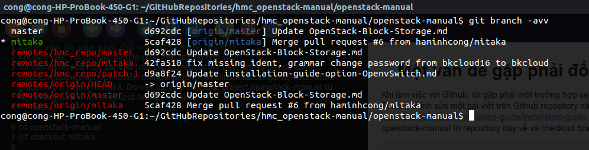

#Một vấn đề gặp phải đối với git remote branch
Khi làm việc với Github, tôi gặp phải một trường hợp sau:
Tôi cần chỉnh sửa một bài viết trên Github repository này: https://github.com/cloudcomputinghust/openstack-manual/blob/mitaka/installation-guide/installation-guide.md, ở branch mitaka. Do vậy lúc này tôi clone project openstack-manual từ repository này về và checkout branch mitaka:
```bash
git clone https://github.com/cloudcomputinghust/openstack-manual
cd openstack-manual
git checkout mitaka
```
Tuy nhiên, lúc này tôi quên mất rằng repo trên, tôi không có quyền push. Lúc này, tôi fork repository trên về tài khoản của tôi tại remote url:
https://github.com/haminhcong/openstack-manual
Sau đó tôi add thêm remote trên vào project hiện tại với tên là hmc_repo:
```bash
git remote add hmc_repo https://github.com/haminhcong/openstack-manual
```
Sau đó, tôi cần fetch nội dung từ remote repository trên về: git-fetch - Download objects and refs from another repository:
```bash
git fetch hmc_repo
```
Kiểm tra lại các branch, kết quả như sau:
 
Bây giờ tôi thực hiện việc checkout branch mitaka từ remote hmc_repo:

```bash
git checkout hmc_repo/mitaka
```
Lúc này git báo cho tôi biết rằng: ``` You are in 'detached HEAD' state```. WTF ?
```bash
cong@cong-HP-ProBook-450-G1:~/GitHubRepositories/hmc_openstack-manual/openstack-manual$ git checkout hmc_repo/mitaka 
Note: checking out 'hmc_repo/mitaka'.

You are in 'detached HEAD' state. You can look around, make experimental
changes and commit them, and you can discard any commits you make in this
state without impacting any branches by performing another checkout.

If you want to create a new branch to retain commits you create, you may
do so (now or later) by using -b with the checkout command again. Example:

  git checkout -b new_branch_name

HEAD is now at 42fa510... fix missing ident, grammar change password from bkcloud16 to bkcloud

```
Vấn đề lúc này là, tôi không xác định local branch  chứa remote branch. Lẽ ra tôi cần xác định local branch sẽ tương ứng với remote branch được checkout về (vì remote branch trên chưa tồn tại trên hệ thống. Nghĩa là lẽ ra tôi cần sử dụng câu lệnh này:
```bash
git checkout -b hmc_mitaka_repo hmc_repo/mitaka

Branch hmc_mitaka_repo set up to track remote branch mitaka from hmc_repo.
Switched to a new branch 'hmc_mitaka_repo'

cong@cong-HP-ProBook-450-G1:~/GitHubRepositories/hmc_openstack-manual/test_branch/openstack-manual$ git branch -vva

* hmc_mitaka_repo          42fa510 [hmc_repo/mitaka] fix missing ident, grammar change password from bkcloud16 to bkcloud
  master                   d692cdc [origin/master] Update OpenStack-Block-Storage.md
  mitaka                   5caf428 [origin/mitaka] Merge pull request #6 from haminhcong/mitaka
  remotes/hmc_repo/master  d692cdc Update OpenStack-Block-Storage.md
  remotes/hmc_repo/mitaka  42fa510 fix missing ident, grammar change password from bkcloud16 to bkcloud
  remotes/hmc_repo/patch-1 d9a8f24 Update installation-guide-option-OpenvSwitch.md
  remotes/origin/HEAD      -> origin/master
  remotes/origin/master    d692cdc Update OpenStack-Block-Storage.md
  remotes/origin/mitaka    5caf428 Merge pull request #6 from haminhcong/mitaka
```
Quay trở lại với trường hợp lúc nãy, sau khi git báo cho tôi rằng ``` You are in 'detached HEAD' state```, tôi lỡ tiến hành add thêm một commit vào HEAD:

```bash
cong@cong-HP-ProBook-450-G1:~/GitHubRepositories/hmc_openstack-manual/openstack-manual$ git status
HEAD detached at hmc_repo/mitaka
Changes to be committed:
  (use "git reset HEAD <file>..." to unstage)

	modified:   installation-guide/installation-guide.md

cong@cong-HP-ProBook-450-G1:~/GitHubRepositories/hmc_openstack-manual/openstack-manual$ git commit -m "fix some bugs, remove index number"
[detached HEAD 73371c6] fix some bugs, remove index number
 1 file changed, 5 insertions(+), 5 deletions(-)
cong@cong-HP-ProBook-450-G1:~/GitHubRepositories/hmc_openstack-manual/openstack-manual$ git status
HEAD detached from hmc_repo/mitaka
nothing to commit, working directory clean
cong@cong-HP-ProBook-450-G1:~/GitHubRepositories/hmc_openstack-manual/openstack-manual$ 
```
Bây giờ local project của tôi sẽ có hình dạng như sau:

```bash

cong@cong-HP-ProBook-450-G1:~/GitHubRepositories/hmc_openstack-manual/openstack-manual$ git log --oneline --decorate --graph --all
* 73371c6 (HEAD) fix some bugs, remove index number
|
* 42fa510 (hmc_repo/mitaka) fix missing ident, grammar change password from bkcloud16 to bkcloud
| 
*   95a4934 Merge pull request #4 from haminhcong/patch-1
|\  
| * d9a8f24 (hmc_repo/patch-1) Update installation-guide-option-OpenvSwitch.md
|/  
* f3aa9a5 Update installation-guide.md
* 6d86093 Update installation-guide.md
* 4ea2219 Update installation-guide.md
* c360869 Update installation-guide.md
* 3eebfe5 Update installation-guide.md
* ac37a9a Update installation-guide.md
* c0f5bf5 Update installation-guide.md
* 5a23ea7 update
```
Có thể thấy là bây giờ, HEAD không còn trỏ vào đầu branch nữa, mà lại trỏ vào một commit, và đầu branch lại không trỏ vào commit này. Vậy nguyên nhân là gì ?

Chúng ta cần phải hiểu, khái niệm HEAD là gì, nhiệm vụ của nó trong Git, chúng ta có thể hiểu được HEAD là gì từ link sau:
http://stackoverflow.com/questions/5772192/how-can-i-reconcile-detached-head-with-master-origin

```sh
HEAD is the symbolic name for the currently checked out commit. When HEAD is not detached (the “normal”1 situation: you have a branch checked out), HEAD actually points to a branch’s “ref” and the branch points to the commit. HEAD is thus “attached” to a branch. When you make a new commit, the branch that HEAD points to is updated to point to the new commit. HEAD follows automatically since it just points to the branch.
```
chúng ta có thể thấy, HEAD là đại diện cho commit hiện tại đang được checkout ra working directory.
Trong trạng thái bình thường, HEAD ở trạng thái "not detached" (ví dụ khi bạn mới clone một repository từ git hub về local). Khi HEAD ở trạng thái "not detached", HEAD trỏ (point) vào branch-metadata (branch-metadata là object chứa thông tin về một branch) mà chúng ta đang làm việc, và branch-metadata đó lại trỏ vào commit hiện tại đang checkout ra working directory. Ví dụ:

 Như chúng ta có thể thấy, hiện tại head đang trỏ vào branch-metadata của branch master, branch-metadata này lại trỏ vào commit f30ab. Điều này có nghĩa là HEAD đang đại diện cho f30ab, đồng thời nó cung cấp cho chúng ta biết chúng ta đang làm việc trên branch master.
 Bây giờ, khi chúng ta thực hiện câu lệnh:
 
```bash
git checkout testing
```
Thì lúc này HEAD sẽ trỏ vào branch-metadata của branch testing
 

Tài liệu tham khảo về cơ chế HEAD trong git:
https://git-scm.com/book/en/v1/Git-Branching-What-a-Branch-Is

Vậy tại sao, chúng ta lại rơi vào trạng thái **detached HEAD ?**
```sh
When HEAD is detached, it points directly to a commit—instead of indirectly pointing to one through a branch. You can think of a detached HEAD as being on an unnamed branch.
```
Ở trạng thái **non-detached**, HEAD sẽ trỏ vào branch-metadata. Tuy nhiên, khi HEAD ở trạng thái **detached**, HEAD sẽ trỏ trực tiếp vào commit chứ không trỏ gián tiếp vào commit thông qua branch-metadata nữa.
 
 Khi bạn thực hiện câu lệnh: 
```bash
git checkout hmc_repo/mitaka 
```
Bạn thực hiện việc đưa HEAD tới trỏ vào commit cuối cùng trên branch hmc_repo/mitaka. Tuy nhiên, hmc_repo/mitaka là một remote branch, do vậy lẽ ra bạn cần tạo một local branch mới bằng cách đưa vào câu lệnh trên option ```-b <local_branch_name>```. Vì bạn không đưa vào option này, nên kết quả của câu lệnh này là HEAD thay vì trỏ vào một branch-metadata, nó lại lấy ra danh sách commit của branch hmc_repo/mitaka rồi trỏ trực tiếp vào commit cuối cùng của branch này(vì đây là remote branch, nên tất nhiên là nó không có branch-metadata trên máy local).

Quay trở lại với hình dạng lúc này của project:
```bash

cong@cong-HP-ProBook-450-G1:~/GitHubRepositories/hmc_openstack-manual/openstack-manual$ git log --oneline --decorate --graph --all
* 73371c6 (HEAD) fix some bugs, remove index number
|
* 42fa510 (hmc_repo/mitaka) fix missing ident, grammar change password from bkcloud16 to bkcloud
| 
*   95a4934 Merge pull request #4 from haminhcong/patch-1
|\  
| * d9a8f24 (hmc_repo/patch-1) Update installation-guide-option-OpenvSwitch.md
|/  
* f3aa9a5 Update installation-guide.md
* 6d86093 Update installation-guide.md
* 4ea2219 Update installation-guide.md
* c360869 Update installation-guide.md
* 3eebfe5 Update installation-guide.md
* ac37a9a Update installation-guide.md
* c0f5bf5 Update installation-guide.md
* 5a23ea7 update
```
Bây giờ ta có thể thấy, sau khi chúng ta thực hiện câu lệnh ```git commit```, HEAD trỏ trực tiếp vào commit cuối cùng chứ không trỏ thông qua branch-metadata nào. Để khắc phục điều này, đầu tiên chúng ta cần tạo một local branch mới, sau đó switch sang branch này:
```bash
cong@cong-HP-ProBook-450-G1:~/GitHubRepositories/hmc_openstack-manual/openstack-manual$ git branch hmc_repo_mitaka
cong@cong-HP-ProBook-450-G1:~/GitHubRepositories/hmc_openstack-manual/openstack-manual$ git checkout hmc_repo_mitaka 
Switched to branch 'hmc_repo_mitaka'

```
Kiểm tra lại project của chúng ta:
```bash
cong@cong-HP-ProBook-450-G1:~/GitHubRepositories/hmc_openstack-manual/openstack-manual$ git log --oneline --decorate --graph --all
* 73371c6 (HEAD, hmc_repo_mitaka) fix some bugs, remove index number
|
|
|
*   95a4934 Merge pull request #4 from haminhcong/patch-1
|\  
| * d9a8f24 (hmc_repo/patch-1) Update installation-guide-option-OpenvSwitch.md
|/  
* f3aa9a5 Update installation-guide.md
* 6d86093 Update installation-guide.md
* 4ea2219 Update installation-guide.md
```
lúc này, branch-metadata của branch hmc_repo_mitaka sẽ trỏ vào commit cuối cùng, và HEAD sẽ trỏ vào branch-metadta của hmc_repo_mitaka branch.

Lưu ý, khi chúng ta muốn push các commit mà chúng ta tạo ra từ local branch hmc_repo_mitaka lên remote branch hmc_repo/mitaka, chúng ta cần sử dụng câu lệnh sau:
```bash
cong@cong-HP-ProBook-450-G1:~/GitHubRepositories/hmc_openstack-manual/openstack-manual$ git push hmc_repo hmc_repo_mitaka:mitaka 
```
câu lệnh git push trên cần chỉ ra remote mà chúng ta muốn update lên (hmc_repo), local_branch mà chúng ta lấy các commit để push (hmc_repo_mitaka), remote_branch mà chúng ta muốn update(mitaka)
Kết quả thu được:
```bash
Counting objects: 11, done.
Delta compression using up to 4 threads.
Compressing objects: 100% (4/4), done.
Writing objects: 100% (4/4), 435 bytes | 0 bytes/s, done.
Total 4 (delta 2), reused 0 (delta 0)
remote: Resolving deltas: 100% (2/2), completed with 2 local objects.
To https://github.com/haminhcong/openstack-manual
   42fa510..73371c6  hmc_repo_mitaka -> mitaka

```